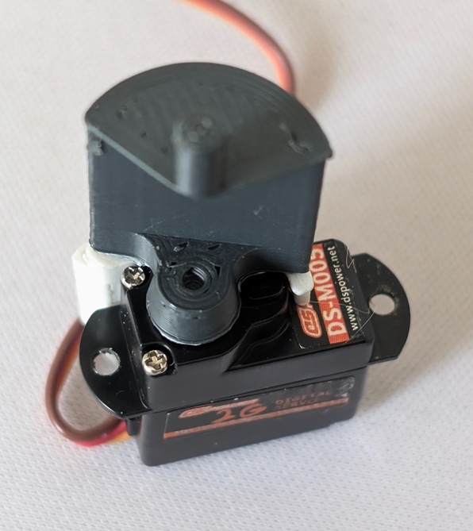
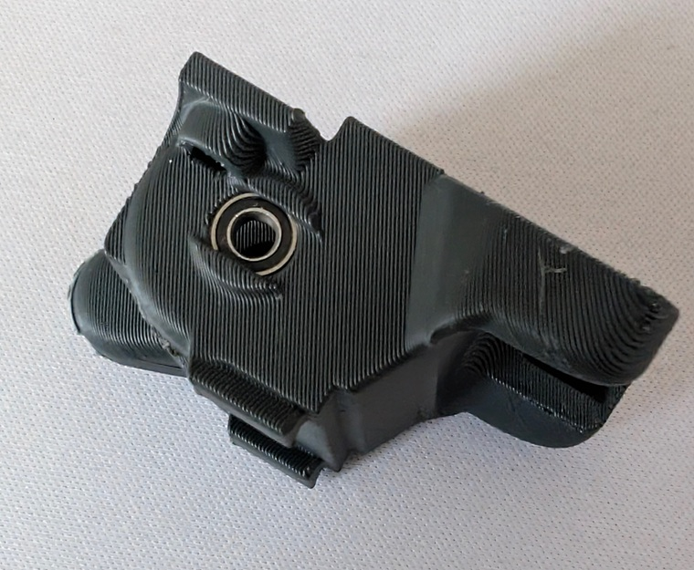
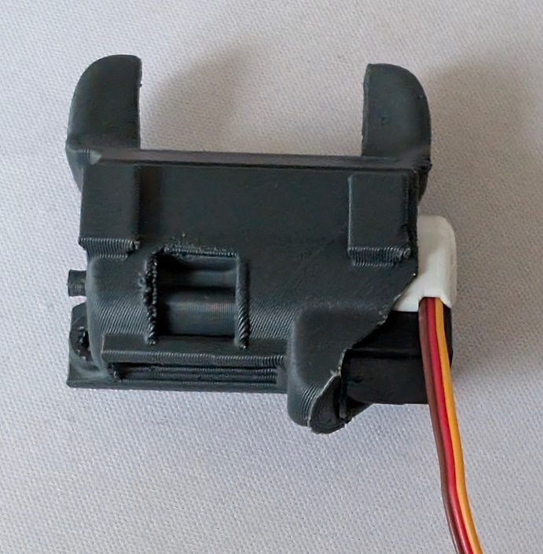
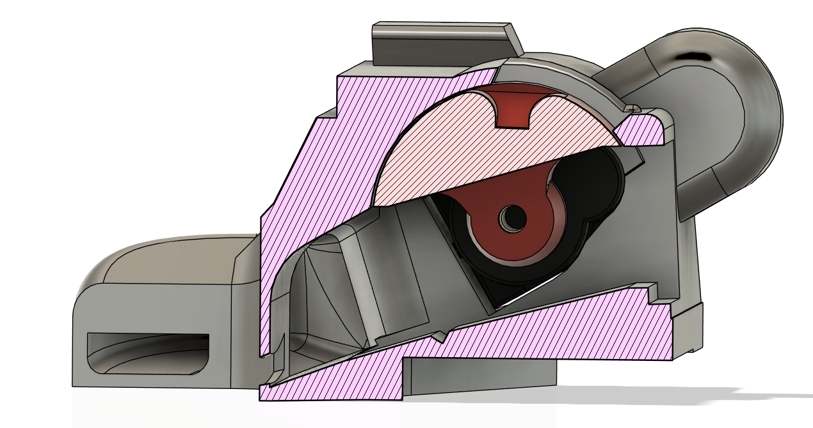
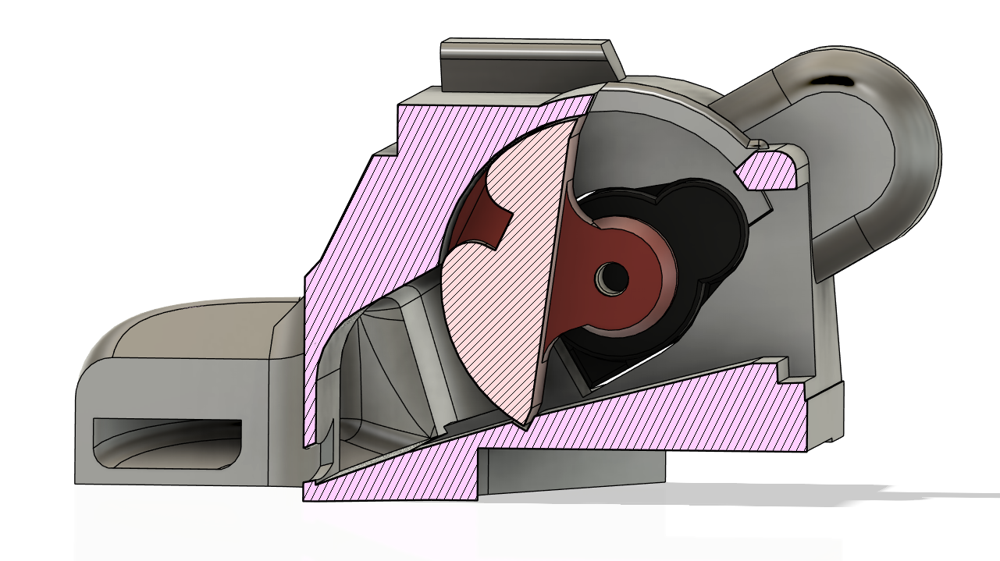

# Valve installation

The valve installation is tricky by the fact that the servos have no stop point so getting the valve angle right is difficult. 

Start by powering on the servo and set the angle to 90 degrees so that it's at known angle.

Then attach the shim and press on the valve so that it aligns with the shim.
Once pressed on, secure the valve with a screw or a bit of superglue. It will rattle loose otherwise.

Then install the bearing on the opposite side.

Then carefullly push the valve assembly into the shroud. Note the servo wire routing.

And secure with 2 M2 x4 screws.

## Fine tuning the servo angle.

90 degrees is your fully open angle. And fully closed should be about 165 degrees, but will depend on your servo, so test and adjust as necessary.

See [Example klipper config](Klipper/CPAP_mcu.cfg)  for valve and CPAP control

| Valve open  | Valve closed |
| ------------- | ------------- |
|   |  |

